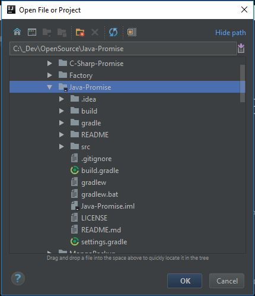
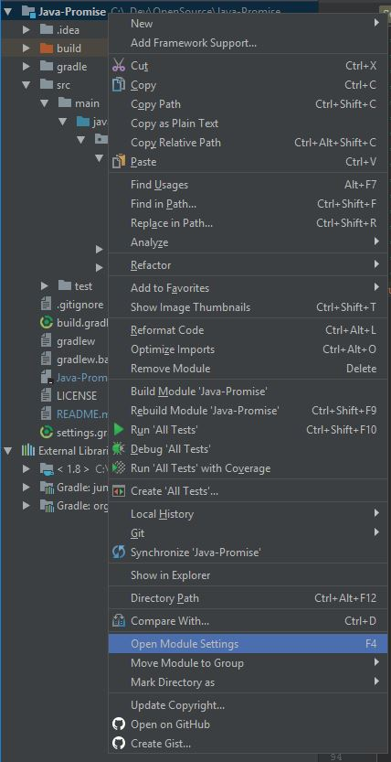
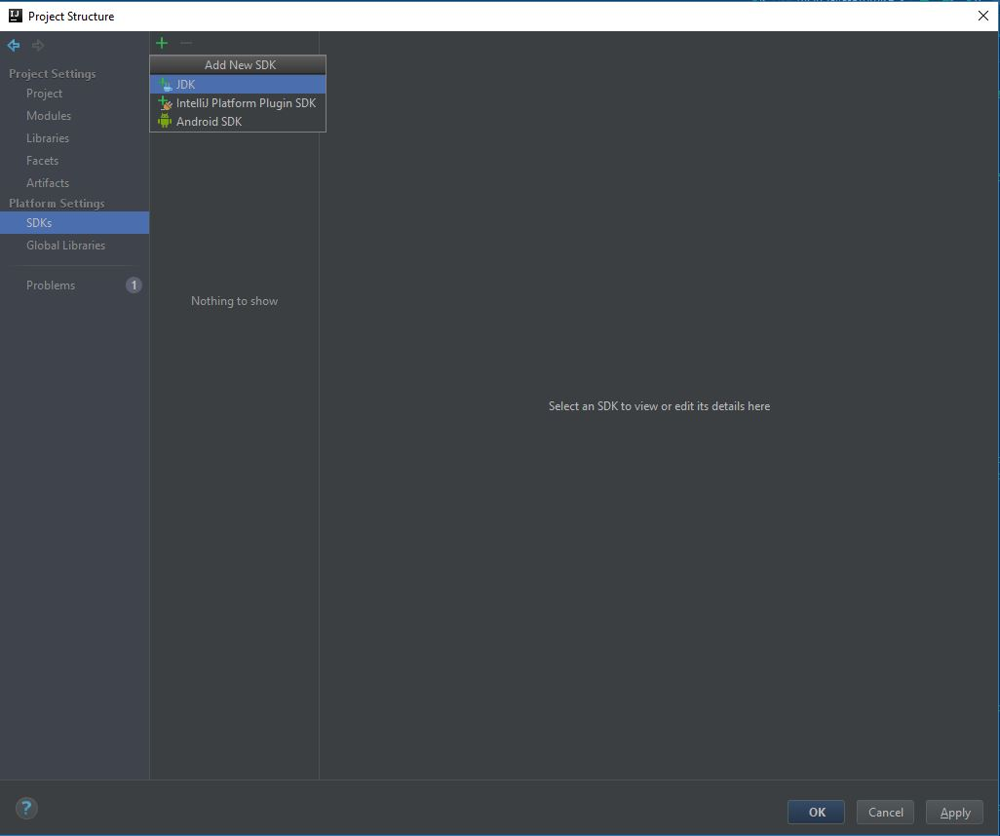
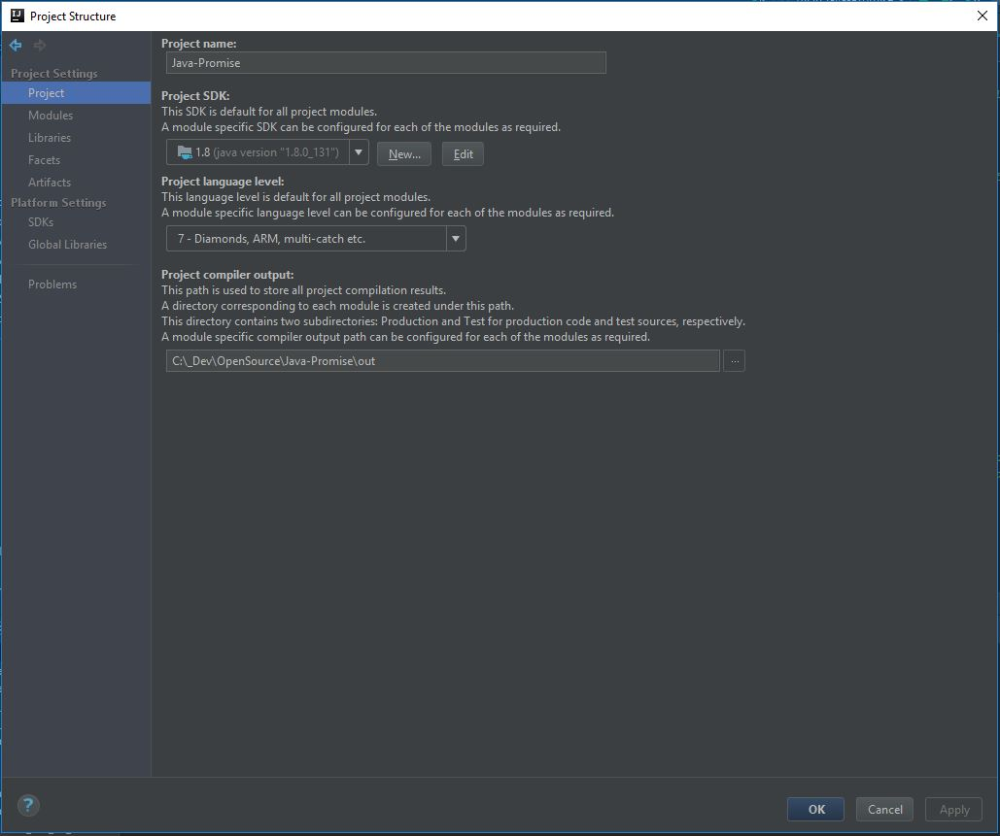
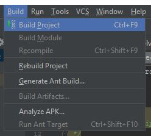
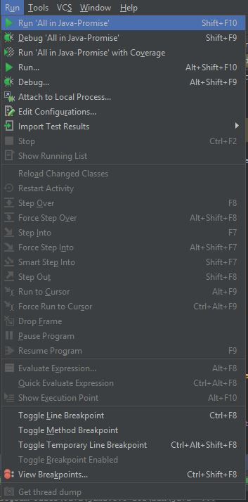

# Java-Promise
An implementation of the A+ standard of a promise for Java. The project is still under development and currently **not ready for production projects**.

# Setup build environment

Java promise is a Gradle project. If you are not familar with this build system we have provided some instructions to get the project up and running on your computer.

## Install JDK 1.7 or later.

http://www.oracle.com/technetwork/java/javase/downloads/index.html

Take note of where you install the JDK as you will need this later.

## Install IDE

https://www.jetbrains.com/idea/download/

## Open project

Open the project in Intellij by pressing **Open and selecting the project folder.

## Add JDK to IntelliJ

Once the project has opened open the Module Settings for the Java-Promise project by **right-clicking on the project** then select **Open Module Settings**.

Add the JDK installed earlier by pressing the **Plus icon in the SDKs tab**.

Once the JDK has been added to the SDK list select the **Project SDK in the Project Tab**

Ensure that you select a **Project Language Level** of 7 or later as well to ensure that generics are supported. 

## Build project

Once you have your environment setup you can build the project by  selecting **Build Project in the Build menu**.

## Run tests

To run the tests select **Run 'All in Java-Promise' in the Run menu dropdown**. 

